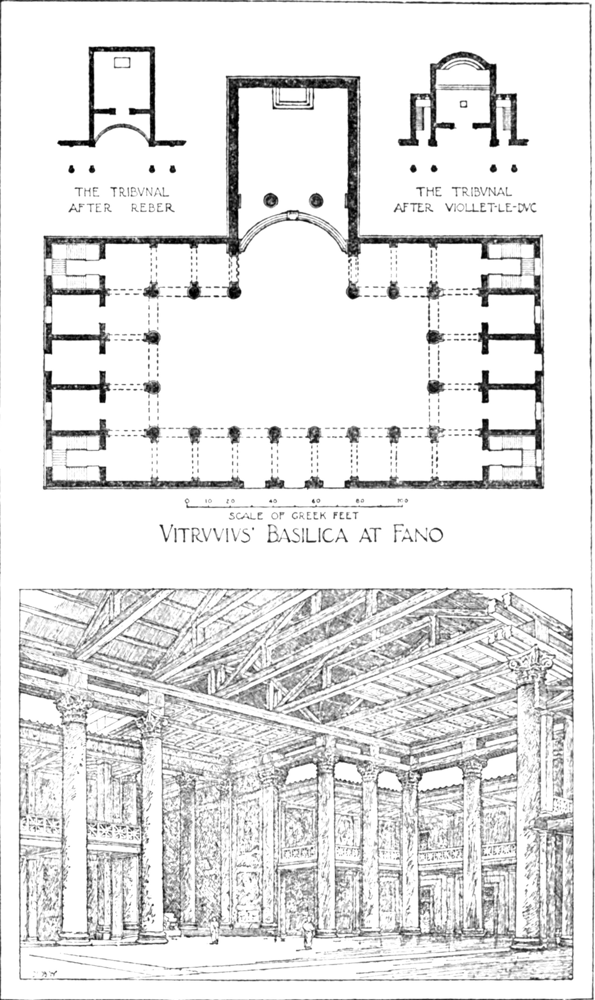

# Day 0: From a Roman Architect to a GitHub Repo — Without Writing a Line of Code

*Posted April 19, 2026 · Karl Kuhnhausen*

---



*Vitruvius' Basilica at Fano — the only building Vitruvius claims to have designed himself, described in Book V of De Architectura. Floor plan and interior reconstruction. Image: [Wikipedia](https://en.wikipedia.org/wiki/Basilica_of_Fano), public domain.*

---

I have been writing code since the early 1980s.

COBOL. Pascal. BASIC. PL/I. C#. Visual Basic. VB.NET. JavaScript. Python. Scripting languages I have half-forgotten the names of. For over four decades, building software meant sitting down and typing — and I was good at it.

Then I injured my hand. And somewhere in the frustration of not being able to do the thing I had done my whole career, I started asking a different question. Not *how do I write this code* — but *do I actually need to write it at all?*

This blog is the story of what happened when I decided the answer was no.

---

## It Started With a Dead Roman

Before I touched a terminal, before I created a single file, I started with a conversation about an architect who died around 20 BCE.

His name was Marcus Vitruvius Pollio. Military engineer. Architect. Theorist. He served under Julius Caesar and Augustus, spent a career building war machines and public structures, and somewhere around 25 BCE wrote a ten-volume treatise called *De Architectura* — the only comprehensive work on architecture to survive from classical antiquity. Almost nothing is known about the man himself. His birth date, birthplace, and biography are all conjecture. What we have is his ideas.

And his ideas are extraordinary.

Vitruvius believed that all great architecture rested on six principles. Not aesthetics — *principles*. Rules that governed every decision downstream, from the placement of a column to the selection of building materials to the relationship between a structure and the people who would use it. He called them:

**Ordo** — Order. The fundamental organization of the system. How its parts are named, bounded, and arranged into a coherent whole.

**Dispositio** — Arrangement. How the components relate and communicate. The blueprint — not the building, but the logic of how the building works.

**Eurythmia** — Proportion. The Greek idea of harmonious sizing. Nothing over-built, nothing under-powered. Everything in right relationship to everything else.

**Symmetria** — Symmetry. Consistency. Every column built to the same module, every part following the same rationale. What we would now call standards.

**Decor** — Propriety. The right tool for the right job. A temple should look like a temple. A bathhouse should serve bathing. No architectural element should be used for a purpose it was not suited for.

**Distributio** — Economy. Nothing wasted. Materials used efficiently. Complexity earned, not accumulated.

He codified these once. Then any competent builder, in any province of the empire, could construct a sound building without Vitruvius standing on site hammering nails. The *principles* traveled. The execution could be delegated.

*De Architectura* was lost for most of the Middle Ages, tucked away in a monastery in St. Gall, Switzerland. When a Renaissance scholar named Poggio Bracciolini found it in 1416, it detonated across European intellectual culture. Alberti read it. Bramante read it. Michelangelo read it. Leonardo da Vinci read it — and drew the Vitruvian Man directly from Vitruvius's description of human proportion in Book III. The entire Renaissance vocabulary of classical architecture flows from this one rediscovered document.

I came across it in a conversation with Claude, while trying to figure out how to build software without using my hands.

And I realized immediately: this is spec-driven development. Two thousand years before anyone called it that.

---

## Vitruvius as a Software Architect

The parallel is not superficial. It runs all the way down.

Vitruvius was a *practitioner* turned *theorist*. His authority came from having built things — bridges, basilicas, siege engines, aqueducts — and then stepping back to ask what made them good. He didn't become an architectural theorist despite his engineering background. He became one *because* of it. The principles he codified weren't abstract. They were distilled from decades of watching things work and watching things fail.

That's the position I'm in after forty-plus years of writing code in a dozen languages. I know what good architecture looks like. I know what technical debt feels like from the inside. I know which decisions haunt you three years later and which ones hold up. That judgment — that practitioner's knowledge — is the one thing an AI agent cannot supply. It can only execute once you supply it.

Vitruvius's six principles translate directly into cloud architecture decisions:

| Latin | Vitruvian meaning | Azure equivalent |
|---|---|---|
| Ordo | System organization | Service boundaries, naming conventions, environment structure |
| Dispositio | Component relationships | API contracts, data flow, communication patterns |
| Eurythmia | Harmonious proportion | SKU selection, auto-scaling thresholds, cost governance |
| Symmetria | Consistent standards | Coding patterns, error handling, CI/CD pipeline structure |
| Decor | Fitness for purpose | Security baseline, appropriate service selection, compliance |
| Distributio | Economy, nothing wasted | Minimal dependencies, structured logging, operational simplicity |

I used these six principles as the exact structure of my **constitution** — the foundational document that governs everything else in this project. Before a specification is written, before a task is generated, before a line of code is produced, the AI reads the constitution and understands the non-negotiable rules of this particular system.

That is the Vitruvian idea in modern form. The principles travel. The execution is delegated.

---

## The Project

I am building an F1 Race Intelligence Dashboard — a web application that displays live telemetry, championship standings, race-by-race results, driver radio, lap analysis, and car-level performance data from Formula 1 races.

The 2026 season is already underway. Three races in. George Russell won Australia. Kimi Antonelli — Mercedes' young rookie — won China. The Bahrain and Saudi Arabian Grands Prix were cancelled due to the Iran war. Miami is three weeks away and the championship fight is already compelling.

The data comes from **OpenF1** — a free, open-source API requiring no authentication. Real car telemetry. Speed, throttle, brake, DRS status, gear data at 3.7Hz per driver per session. Team radio audio. Pit stop timing. Tyre compounds and stints. It is a remarkable data source sitting there free.

The infrastructure is Azure Kubernetes Service with Cosmos DB serverless as the data store, Azure Firewall for egress, NGINX ingress controller, cert-manager for TLS, Azure Key Vault for secrets via Managed Identity, and GitHub Actions for CI/CD. The backend is Go. The frontend is React. Infrastructure-as-code in Bicep and Helm.

And I have not typed a single line of application code.

---

## The Tooling: GitHub Spec Kit

The workflow is built on **GitHub Spec Kit** — an open-source CLI from GitHub that implements spec-driven development with AI coding agents. It integrates with GitHub Copilot, Claude Code, and others. It installs via `uv`, the Python package manager.

The Spec Kit workflow has three phases, all run as slash commands in the Copilot Chat panel in VS Code in Agent mode:

**`/speckit.constitution`** — You describe your architectural principles and Copilot writes a `constitution.md` into your `.specify/memory/` folder. This is the Vitruvian document. Everything downstream reads it before generating anything.

**`/speckit.specify`** — You describe a feature in detail: what it does, why it exists, what data sources it uses, what the tech stack constraints are. Copilot writes a structured spec into `.specify/specs/`.

**`/speckit.plan` then `/speckit.tasks`** — Copilot reads the constitution and spec together, produces an implementation plan, breaks that plan into discrete tasks, and starts executing — writing actual code, creating actual files, building actual structure.

The slash commands live in the chat window. The terminal handles Git, `uv`, and the GitHub CLI. The AI does the typing.

---

## What Day 0 Actually Looked Like

I will be honest about the sequence, including the friction.

The first issue was the environment. I am on Windows 11 with VS Code and WSL Ubuntu. VS Code's built-in "Connect to WSL" button times out trying to cold-probe the Ubuntu virtual machine — error `HCS_E_CONNECTION_TIMEOUT`, code `4294967295`, looking alarming but meaning simply that the VM was not running yet. The fix: open Ubuntu in Windows Terminal first, then type `code .` from inside the running instance. VS Code connects to an already-warm environment. Launch from inside WSL, not at it from Windows.

Once in, I installed `uv` — Python was already at 3.12.11, well above the minimum:

```bash
curl -LsSf https://astral.sh/uv/install.sh | sh
source ~/.bashrc
```

The GitHub CLI authenticated and the repo created in one shot:

```bash
gh repo create f1-race-intelligence \
  --public \
  --description "F1 Race Intelligence Dashboard — spec-driven development on Azure AKS" \
  --clone
```

Then Spec Kit init — where I immediately hit a deprecation warning. The `--ai` flag I used from the docs was already deprecated in favor of `--integration`:

```bash
uvx --from git+https://github.com/github/spec-kit.git \
  specify init . \
  --integration copilot \
  --script sh
```

That scaffolded `.specify/`, the constitution template, and `.github/copilot-instructions.md` — the file that tells Copilot how to behave inside this repo permanently.

In Copilot Agent mode I ran `/speckit.constitution` with my Vitruvian principles translated into Azure engineering decisions. Then `/speckit.specify` with a detailed feature description for the race calendar and championship standings. Then `/speckit.plan`. Then `/speckit.tasks`.

**What Copilot actually generated by end of day:**

Project scaffolding — Go backend in standard layout (`/cmd`, `/internal`, `/pkg`), React frontend initialized with Vite and Tailwind, Dockerfiles for both services, and a `docker-compose.yml` for local development.

Actual code — a Go `main.go` entry point, a Chi router setup with health check endpoint, initial Cosmos DB client configuration using the Azure SDK, and a React `App.tsx` with routing scaffolded. Not a finished application. A real, working foundation that follows exactly the architecture the constitution described.

Everything committed:

```bash
git add .
git commit -m "chore: initialize spec-kit with F1 dashboard constitution and first feature spec"
git push origin main
```

---

## What I Noticed

**The hardest part was articulating what I wanted.** Not the tooling setup. Not the WSL hiccup. Not the deprecation warning. The thinking. Writing a good constitution requires genuine architectural judgment — knowing which principles matter for *this* system, at *this* scale, with *these* tradeoffs. That judgment is not something the AI has. It comes from having made the wrong call before and remembered the cost.

**The AI respected the constitution.** This surprised me in a good way. The Go code Copilot generated followed the package structure I described. The error responses used the standard shape I specified in the symmetria section. The Cosmos DB client was wired up with Key Vault integration as the constitution required. It did not invent its own conventions when clear conventions were provided. Vitruvius's insight holds: give builders good principles and they produce consistent work.

**Spec-driven development changes what experience is for.** In traditional development, experience helps you write better code faster. In this model, experience helps you write better *specifications* — which is more leveraged. A better spec produces better code across the entire implementation, not just in the section you happened to be focused on.

**The Vitruvius parallel deepens with practice.** He did not become a theorist despite his engineering experience. He became one because of it. Every principle in *De Architectura* traces back to something that either worked or failed in construction. My constitution is the same thing. Every rule in it traces back to a decision I have seen go wrong.

---

## What's Next

The foundation is in place. The repo is public. The constitution governs. The first feature spec exists and Copilot has begun implementation.

Coming posts:

- [**Day 1: Laying the Foundation — Phase 2 and the Architecture That Carries Everything**](day-1-phase-2-foundation.md) — The entire foundational layer: Cosmos DB, polling engines, Key Vault, Azure IaC, Helm charts, CI/CD with OIDC, and the dependency ledger.
- [**Day 2: The First Thing Anyone Sees — Phase 3 and the Race Calendar MVP**](day-2-phase-3-calendar-mvp.md) — The first vertical slice from database to browser. Twenty-four rounds, cancelled race badges, next-race countdown, and fourteen tests.
- **Day 3** — Championship standings, countdown widget, and the polish that makes it production-ready.

The repo is public and every commit tells the story:
[github.com/karlkuhnhausen/f1-race-intelligence](https://github.com/karlkuhnhausen/f1-race-intelligence)

Everything here is being built the way this post was written — with voice, with specifications, and with AI doing the typing.

Vitruvius would recognize the method. He invented it.

*Next: [Day 1: Laying the Foundation — Phase 2 and the Architecture That Carries Everything](day-1-phase-2-foundation.md)*

---

*Karl Kuhnhausen is a software architect and developer with over four decades of experience across COBOL, Pascal, C#, JavaScript, Python, and beyond. He is currently exploring spec-driven, AI-assisted development on Microsoft Azure — entirely hands-free.*
