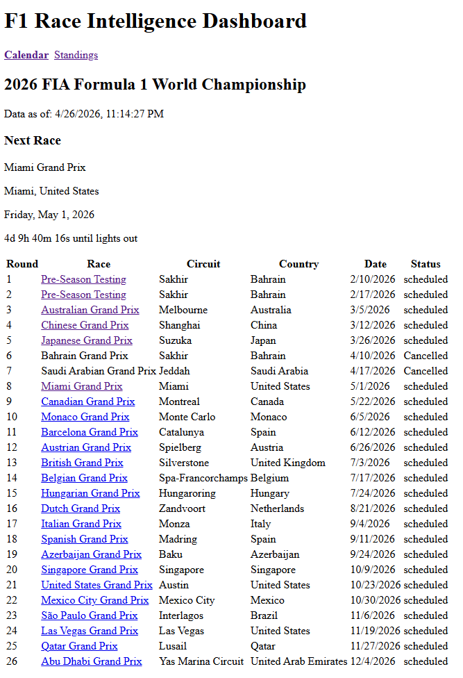
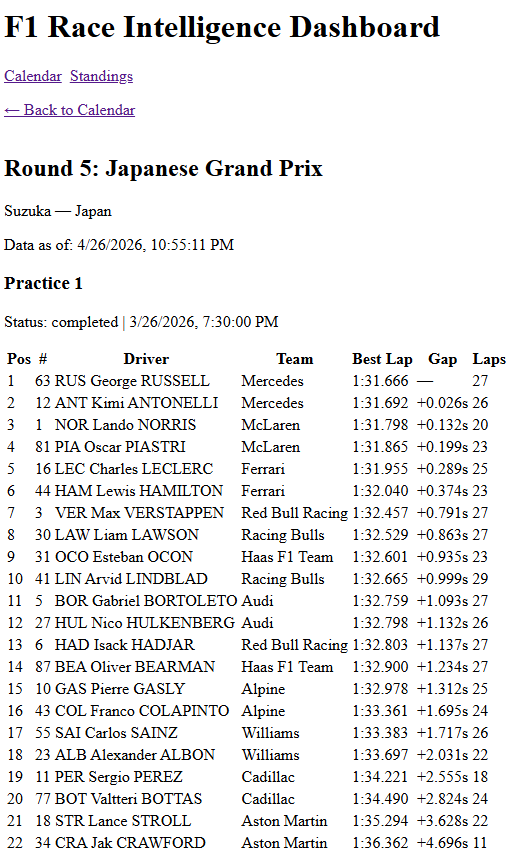
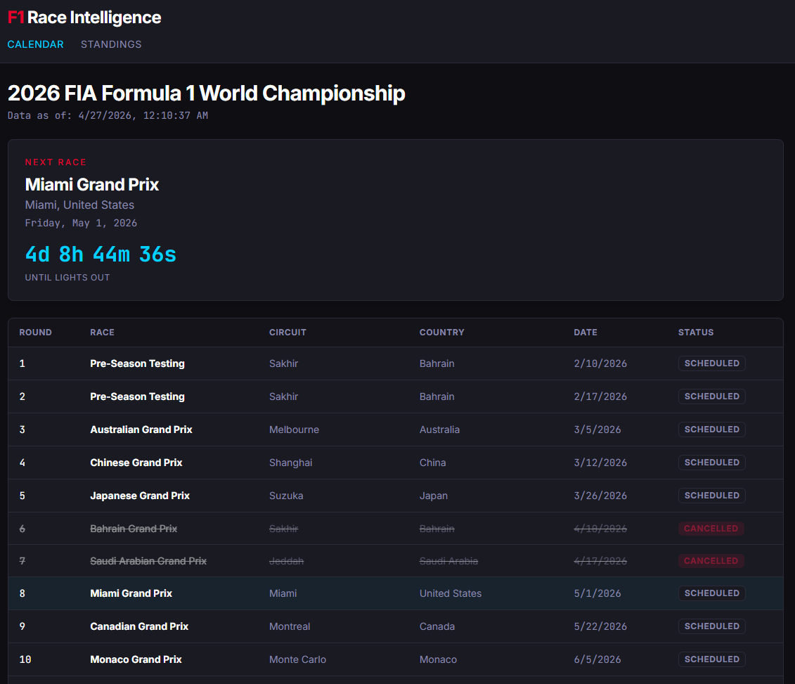
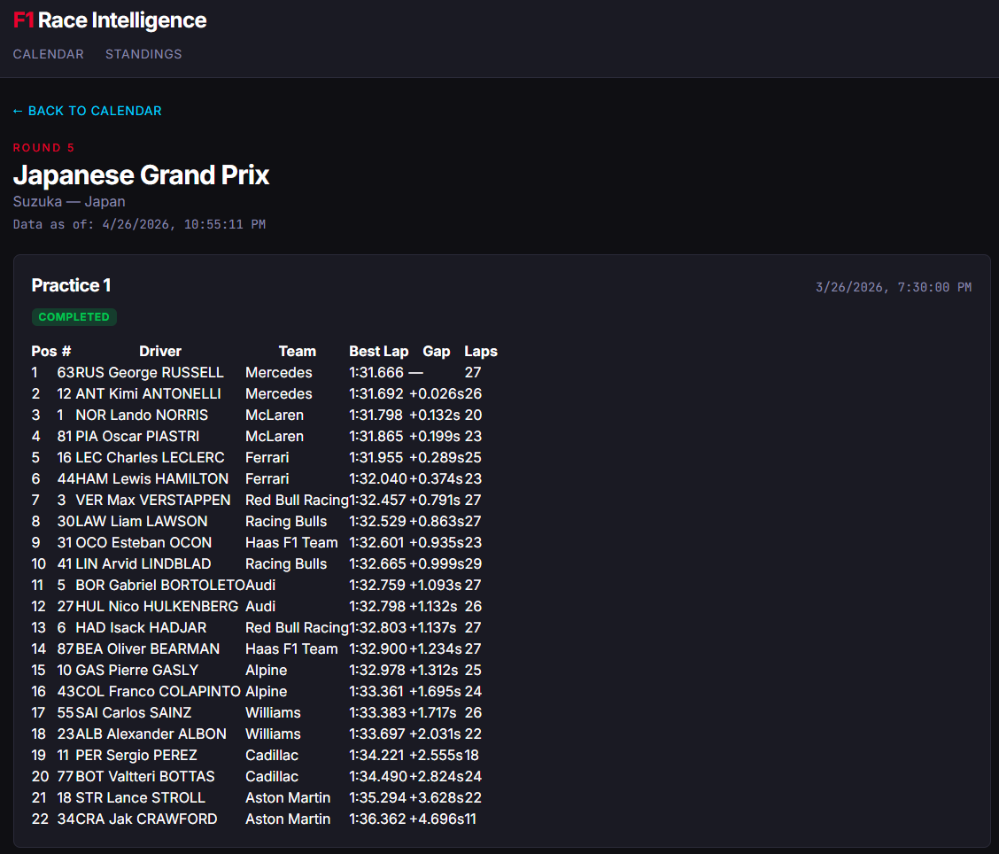

# Day 11: From Generic Data Table to Race Car — A Design System in an Afternoon

*Posted April 27, 2026 · Karl Kuhnhausen*

---

For ten days the dashboard worked. Calendar populated, standings ranked, race results rendered with the right gaps and lap times. It also looked exactly like every other admin panel on the internet. Light grey table on a white page, system font, blue hyperlinks, no identity.

The fastest sport on earth was being presented like a quarterly expense report.

Feature 004 fixed that. Not by adding new functionality — every API call, every Cosmos query, every route is unchanged — but by giving the existing data a look that matches what it represents. Near-black backgrounds. A monospace font for every number. Team colors on every row. A real typographic hierarchy. The same data, but now it feels like motorsport.

This is the story of that transformation.

---

## Before

Here's the calendar before the redesign:

And Round 3 with the race, qualifying, and practice tables that took three PRs to ship in [Day 10](day-10-rate-limit-cascade.md):

The data is correct. The UX is functional. But there's nothing on either page that says "Formula 1." Strip the words and it could be a CRM, a project tracker, or any of ten thousand internal tools. F1 has one of the strongest visual identities in sport — black, red, the precise hex of every team's livery, monospaced telemetry — and none of that was on the page.

---

## After

Same routes. Same data. Same components, mostly. What changed is the design system underneath them.

Background is `#0f0f13`. Card surfaces sit one shade up at `#1a1a23` with a `#2a2a38` border. Body text is Inter; every number — positions, lap times, points, gaps — is JetBrains Mono. Headings use Inter at weight 700 with tight letter-spacing. The accent reds and cyans are pulled from the F1 broadcast palette, not bootstrap defaults. And every standings row, every results row, every driver card carries a left-border accent in its team's color.

That last detail is the one that flips the whole thing from "data table" to "F1 product." A Ferrari row is red. A Mercedes row is teal. A McLaren row is papaya. You can read the leaderboard at a glance, the way you read a starting grid.

---

## The shape of the work

Feature 004 was 37 tasks across 6 phases:

1. **Phase 1 — Foundation.** Install Tailwind v4, `@tailwindcss/vite`, the shadcn CLI primitives (`Button`, `Card`, `Badge`, `Table`), self-hosted Inter and JetBrains Mono via `@fontsource`, and wire up the `@/*` path alias.
2. **Phase 2 — Tokens.** Define the color palette, font stack, and team colors as Tailwind v4 `@theme` values in a single `globals.css`. No `tailwind.config.ts` — v4 reads tokens directly from CSS.
3. **Phase 3 — Atomic components.** Build `DriverCard`, `LapTimeDisplay`, `TireCompound`, `RaceCountdown`, and `StandingsTable` against the new tokens, with unit tests for each.
4. **Phase 4 — Pages.** Migrate the calendar, standings, and round-detail pages to the new utilities. No layout changes, just typography, color, and spacing.
5. **Phase 5 — Polish.** Hover states, focus rings, transitions, the accent-cyan back link, the accent-red round pre-heading.
6. **Phase 6 — Validation.** All existing tests still green; new tests for every new component.

Total: 33 files, +1,794 / −330 lines, 48 frontend tests passing (was 20).

---

## What I'd flag for next time

A few things I learned the hard way that might save someone else an afternoon:

**1. Tailwind v4 doesn't use `tailwind.config.ts`.** I wasted a real amount of time looking for the config file the AI wanted to put tokens in. v4 moved the entire token system into CSS via the `@theme` block. The plugin reads it directly. There is no JS config for tokens. The Tailwind v3 docs and ten thousand blog posts will steer you wrong.

**2. Vitest worker timeouts mean your CSS plugin is being processed in tests.** When I added the `@tailwindcss/vite` plugin, every test started timing out at the worker boot stage with a cryptic "Failed to start threads worker" error. The fix was a one-line change in `vite.config.ts`: `test.css = false`. Tests don't render real CSS, so processing the Tailwind import in worker boot is pure overhead. Skip it.

**3. jsdom serializes inline hex colors as `rgb()`.** I had a test asserting `style.borderLeftColor === '#3671c6'`. It failed. The DOM element's serialized style was `rgb(54, 113, 198)`. jsdom (and real browsers) normalize colors. Either use `rgb()` directly in assertions or fetch the color via `getComputedStyle` and compare via a helper that normalizes both sides.

**4. Display-name vs token-name for team colors.** OpenF1 sometimes returns `"Red Bull Racing"`, sometimes `"red_bull"`, sometimes just `"Red Bull"`. The `getTeamColor()` helper has to handle all three: case-insensitive, whitespace-tolerant, with a token-trimming fallback to "Red Bull" → `redbull` if the literal lookup misses. Get this wrong and a fifth of the grid renders in fallback grey.

**5. Migrating pages last, components first, was the right order.** Building the atomic components in Phase 3 against the tokens — and writing their tests there — meant Phase 4's page migrations were almost mechanical. Most of the page diffs were `className="..."` swaps. Almost no JSX restructuring. The tests caught the few places where a page was relying on undocumented styling.

---

## The PR that nearly didn't merge

The branch was created on April 20. Master had moved on by 13 PRs since then — including PR #14 (qualifying/practice tables) and PR #15 (the rich `/v1/session_result` fields from [Day 10](day-10-rate-limit-cascade.md)) which both touched `RoundDetailPage.tsx`. When I rebased onto current master to open the PR, that file had a real conflict: my Tailwind-migrated version vs master's version that now imports `RaceResults`, `QualifyingResults`, and `PracticeResults` and has an `'upcoming'`-status guard.

The resolution was to keep master's component dispatch logic (it's correct — the new specialized result components do more than the old `SessionResultsTable` ever did) and apply the new Tailwind utilities to the surrounding shell. The wrapper got the dark theme; the result tables came along untouched. Five minutes of work, but it's a nice example of why "design refactor" branches that linger get expensive: the longer they sit, the more the trunk diverges, and the more you end up doing semantic merges by hand.

Lesson: when starting a UI-wide refactor, finish it inside a single sprint, or rebase onto trunk daily. Don't let a design branch age.

---

## What's live now

- **Frontend**: http://f1raceintel.westus3.cloudapp.azure.com/
- **Round Detail**: http://f1raceintel.westus3.cloudapp.azure.com/rounds/3?year=2026
- **Tests**: 70 passing (22 backend + 48 frontend)
- **Bundle**: 225 KB JS / 71 KB gzipped, 25 KB CSS / 7 KB gzipped — Tailwind v4's tree-shake earned its keep
- **Pipeline**: Fully green — lint → test → build → push → deploy

The product looks like an F1 product now. The next feature can be something other than CSS.

---

[← Day 10: The Rate Limit Cascade](day-10-rate-limit-cascade.md)
