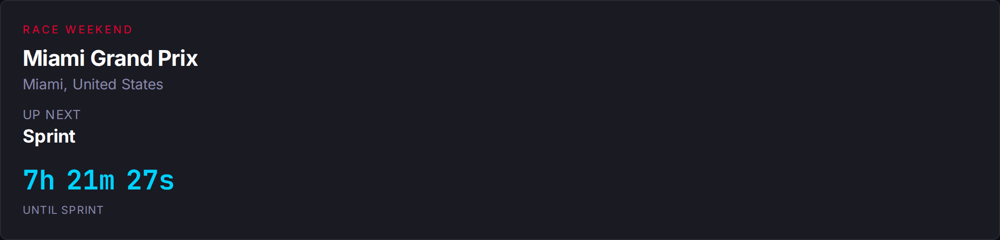

# Day 16: The Countdown Was Lying — Race Weekend Status

*Posted May 2, 2026 · Karl Kuhnhausen*

---

It's Saturday morning of the Miami Grand Prix Sprint weekend. I open the dashboard to check what time the Sprint actually starts, and the calendar page tells me the next race is in **19 days**.

That's wrong on its face — Sprint qualifying ran Friday, the Sprint is later today, and the actual race is tomorrow. The site, smug and expensively deployed in Azure, was showing me a multi-week countdown to the *Canadian* Grand Prix. Mid-race-weekend.

This post is about what that bug actually was, why it had been hiding the entire season, and a small but useful realization about what "next race" even means.

---

## What the page was doing

The calendar page renders one of two states above the fixture list: a **Next Race Countdown** card, or nothing. The countdown card asks the API two things — `next_round` and `countdown_target_utc` — and renders the days/hours/minutes/seconds delta from now.

The `next_round` calculation lived in the domain layer:

```go
func SelectNextRace(meetings []RaceMeeting, now time.Time) NextRaceResult {
    for _, m := range meetings {
        if m.IsCancelled || m.Status == StatusCancelled {
            continue
        }
        if !m.StartDatetimeUTC.After(now) {
            continue                // ← here
        }
        return NextRaceResult{
            Round:           m.Round,
            CountdownTarget: m.StartDatetimeUTC,
            Found:           true,
        }
    }
    return NextRaceResult{}
}
```

Read that skip condition. "Skip any round whose start datetime is not after now."

The pivot is: **what is `StartDatetimeUTC`?** I'd been carrying around an unexamined intuition that it meant "race start" — Sunday lights-out. It doesn't. Look at the ingest transform:

```go
m := storage.RaceMeeting{
    StartDatetimeUTC: startUTC,                          // OpenF1 meeting.date_start
    EndDatetimeUTC:   startUTC.Add(3 * 24 * time.Hour),  // Friday + 72h
    ...
}
```

OpenF1's `date_start` for a meeting is the **first session of the weekend**. For Miami that's Practice 1 on Friday at 17:30 UTC, not the Sunday race at 19:00 UTC. So once Friday FP1 began, the selector saw `StartDatetimeUTC` in the past, marked the entire Miami round as "past," and walked forward to Canada.

The bug was structural. It would fire every Friday of every race weekend, for the entire season, until the weekend ended. I just hadn't been on the dashboard at exactly the right moment until today.

---

## The rename that wasn't

There's a programming-language joke here: the field is called `StartDatetimeUTC` and you'd reasonably assume it starts the *thing the page calls a "race."* But in motorsport, "race weekend" and "race" are different objects. A weekend has a window (Friday FP1 through Sunday race). The race itself is one ~2-hour session inside that window.

The data model was modeling weekends. The selector was treating them like races. The bug is the gap between those two intuitions.

I considered renaming to `WeekendStartUTC` / `WeekendEndUTC`. I didn't, because:

1. Storage rows are persisted, and renaming the JSON key requires a migration.
2. The names are accurate to the *meeting* (which is what OpenF1 calls them).
3. The fix doesn't need a rename — it needs the *consumer* of those dates to think in weekends.

So the fix is two lines:

```go
end := m.EndDatetimeUTC
if end.IsZero() && !m.StartDatetimeUTC.IsZero() {
    end = m.StartDatetimeUTC.Add(72 * time.Hour)
}
if !end.IsZero() && !end.After(now) {
    continue
}
```

A round is "past" once its **weekend window** has ended, not once its first session has started. Now the selector returns Miami all the way through Sunday's race, and only flips to Canada once the weekend is over.

---

## "Next race" was the wrong question

Fixing the skip was 80% of the problem. The other 20% is more interesting: even with the right round selected, what should the page *say*?

Counting down to the Sunday race time during a weekend isn't quite right either. On Saturday, the thing I actually want to know is "when does the Sprint start." On a normal Saturday it's "when does Qualifying start." On Friday it's "Practice 2 in 90 minutes." The lights-out countdown is interesting on Tuesday, less interesting on Saturday afternoon.

The data to do better was already in the database. Feature 3 added a `sessions` collection — every Practice / Sprint Qualifying / Sprint / Qualifying / Race session for every round, with start and end timestamps. The round detail page was already using it. The calendar page just hadn't asked.

So the calendar service got a small piece of new logic. When the next round's weekend window contains *now*, the API:

1. Loads the sessions for that round.
2. Picks the **active session** — the one currently in progress, else the next upcoming, else the last completed.
3. Surfaces it on the response as `active_session`, with a `session_type` (`practice1` / `sprint_qualifying` / `sprint` / `qualifying` / `race` / etc.) and a status (`upcoming` / `in_progress` / `completed`).
4. Re-targets `countdown_target_utc` to *that session's* start (or end, if it's live).

```json
{
  "year": 2026,
  "next_round": 8,
  "countdown_target_utc": "2026-05-02T16:00:00Z",
  "weekend_in_progress": true,
  "active_session": {
    "session_type": "sprint",
    "session_name": "Sprint",
    "status": "upcoming",
    "date_start_utc": "2026-05-02T16:00:00Z",
    "date_end_utc":   "2026-05-02T17:00:00Z"
  },
  "rounds": [...]
}
```

Picking the active session is the kind of thing that's easy to get subtly wrong, so it lives in the domain layer with its own unit tests:

```go
func SelectActiveSession(sessions []SessionWindow, now time.Time) (ActiveSession, bool) {
    // sort by start time; then:
    // 1. first in_progress session wins
    // 2. else first upcoming session wins
    // 3. else last completed session (weekend wrapping up)
}
```

Three cases. Five tests. The interesting one is case 3 — once the Sunday race is over but the dashboard is still showing weekend context, the card reads "Just finished — Race" instead of jumping back to a generic countdown. Then once `now > EndDatetimeUTC`, the selector advances to the next round and the regular countdown card reappears.

---

## What it looks like

Here's the dashboard right now, mid-Miami-Sprint-weekend, with the fix live:



Eyebrow says **RACE WEEKEND**. Race name and circuit. "UP NEXT: Sprint." Countdown to Sprint lights-out. When the Sprint goes live, the eyebrow flips to **RACE WEEKEND · LIVE**, the label changes to "Now: Sprint," and the countdown becomes the time remaining in the session. When the session ends, it walks to "Up Next: Race." When the Race ends, it shows "Just finished: Race." When the weekend window closes Sunday night, the card flips back to the regular **Next Race** countdown pointing at Canada.

State machines for state machines. Each transition is just `now` crossing a session boundary.

---

## The shape of the fix

| Layer | Change |
|---|---|
| `domain/next_race_selector.go` | Skip rounds based on **weekend end**, not weekend start. Two lines. |
| `domain/active_session.go` | New file. `SelectActiveSession` (live > upcoming > last completed) + `DeriveSessionStatus`. |
| `api/calendar/service.go` | Optionally takes a `SessionRepository`. When the next round's window contains `now`, populate `weekend_in_progress` + `active_session`, retarget the countdown. |
| `api/router.go` | Wire the existing `sessionRepo` into the calendar service constructor. |
| `frontend/calendar/RaceWeekendCard.tsx` | New component. Eyebrow / race name / "Now \| Up Next \| Just finished" / session label / session-scoped countdown. |
| `frontend/calendar/CalendarPage.tsx` | Branch: `weekend_in_progress` → `RaceWeekendCard`, else → existing `NextRaceCard`. |

Backend has new unit tests for the selector's weekend behavior, for `SelectActiveSession`, and for the calendar service's enrichment. Frontend has a new `RaceWeekendCard.test.tsx` covering all four states.

There was also a small embarrassment in the existing integration tests. `TestCountdownTransition_AfterMiami` was using `2026-05-05` as "after Miami" — but Miami's weekend window doesn't end until 2026-05-07 19:00 UTC. The test had been *asserting the buggy behavior*: "after May 5, the next round should already be Spanish GP." The fix exposed it. I bumped the timestamp to May 8 and the test went green for the right reason.

This is the classic shape of a test that locks in a bug. It looked like coverage. It was actually concrete.

---

## Patterns I keep seeing

This is the second time this season a bug has come from "the cached/stored value disagreed with what `now` says." [Day 12](day-12-status-badge-bug.md) was about session statuses being hardcoded `"completed"` at write-time, fixed by deriving status at *read* time from dates and clock. [Day 14](day-14-design-polish.md) was about meeting status going stale because the ingest layer wrote it once and never updated. This one is about a derived-from-dates value (`is the round past?`) that *was* being computed at read time, but from the wrong field.

The pattern is: **anything that's a function of the wall clock should be computed at read time, from the underlying timestamps, and the storage layer should hold timestamps not derived states.** Status fields, "is this past," "is this in progress," "what's next" — none of these belong in Cosmos as scalars. They belong as functions over the timestamps that *are* in Cosmos.

The architecture was already mostly aligned with this. I just had a remaining selector that was reading the wrong timestamp.

---

## What's live

- **PR**: [#32](https://github.com/karlkuhnhausen/f1-race-intelligence/pull/32) — squash-merged to `master`. CI ran the full lint → test → build → push → deploy chain. Live on the deployed AKS app within ~15 minutes of the commit.
- **Tests**: 61/61 frontend, all backend packages green. Three new backend unit-test files plus one corrected integration test. One new frontend test file.
- **Behavior**: the calendar's countdown card now correctly tracks the active session through the weekend, and only flips back to "next race" once Sunday's race window closes.

The Miami Sprint goes off in 7 hours and 21 minutes. I know because the dashboard finally tells me.

---

[← Day 15: Feature 4 — What a "Pure Frontend" Feature Actually Cost](day-15-feature-004-wrap.md)
