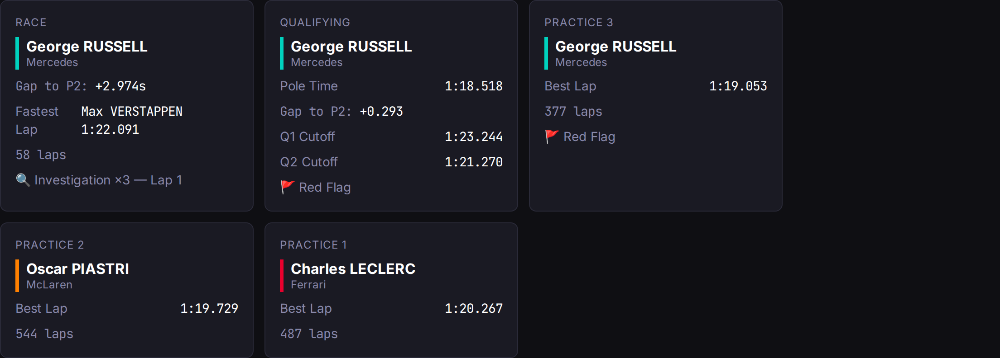
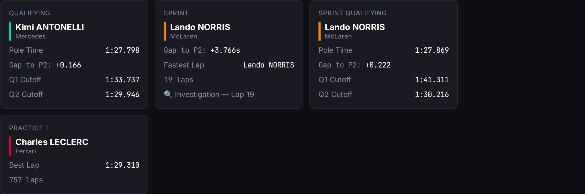

# Day 19: The Session Recap Strip — Summarizing a Weekend at a Glance

*Posted May 2, 2026 · Karl Kuhnhausen*

---

Feature 005. A horizontal strip of recap cards on the round detail page — one card per completed session, showing the headline result without expanding into full tables.

This is the "newspaper front page" for a race weekend: winner, gap to P2, fastest lap, safety cars, red flags. All derived from data we already store. No new external API calls at read time.

---

## The Constraint: Free Tier Only

OpenF1's free tier gives you historical data — anything outside the T-30min to T+30min session window. Live data requires a €9.90/month sponsorship tier.

This feature was designed to stay entirely within the free boundary. The race-control data (`/v1/race_control`) is fetched once at session finalization — the same moment we already pull results — and cached in Cosmos DB. After that, every page load is purely Cosmos → client. Zero OpenF1 traffic for recap rendering.

---

## What Gets Summarized

Each session type gets its own card shape:

**Race / Sprint** — Winner + team, gap to P2, fastest lap holder + time, total laps, top race-control event (red flag, SC, VSC).

**Qualifying / Sprint Qualifying** — Pole sitter + team, pole time, gap to P2, Q1/Q2 cutoff times, red flag count.

**Practice** — Best driver + team, best lap time, total laps completed, red flag count.

Cards render left-to-right in descending date order: Race → Qualifying → Practice 2 → Practice 1. Sprint weekends interleave naturally because sorting is purely by timestamp.

Here's the Australian Grand Prix — a traditional weekend with all five sessions. George Russell dominated, and you can immediately see the red flags in qualifying and FP3:



And the Miami Grand Prix — a sprint weekend. The layout adapts naturally: Qualifying, Sprint, Sprint Qualifying, and Practice 1. Lando Norris took the sprint win while Kimi Antonelli grabbed qualifying pole:



---

## Race Control Ingestion

The new `ingest/race_control.go` module does three things:

1. **Fetch** — HTTP GET to `/v1/race_control?session_key={key}`, returns a list of flag/message events with lap numbers.
2. **Summarize** — Deduplicates by activation type + lap number (a safety car has a DEPLOYED and an ENDING message on the same lap — we count it once), categorizes into red flags, safety cars, VSCs, and investigations, then picks a priority-ordered "top event" for headline display.
3. **Hydrate** — Called both at finalization (proactive) and lazily at read time (for pre-existing sessions that were finalized before this feature shipped).

The lazy fill is a graceful degradation pattern: if a session is completed but has no `RaceControlSummary`, the rounds service tries to hydrate it inline. If that fails (rate limit, OpenF1 down), it logs a warning and renders the card without the race-control line. No user-visible error.

---

## The Backfill Problem

Sessions finalized before Feature 005 have results but no race-control data. We could lazy-fill everything at read time, but that risks rate-limit storms when someone pages through multiple rounds.

Solution: a one-shot CLI at `cmd/backfill/main.go`:

```bash
go run ./cmd/backfill --season=2026 --dry-run     # preview
go run ./cmd/backfill --season=2026                # apply
go run ./cmd/backfill --season=2026 --rate-limit-ms=2000  # slower
```

It reads all finalized sessions from Cosmos, skips any that already have a summary (idempotent), fetches race-control data from OpenF1 with configurable rate limiting, and upserts. Structured JSON logs per session. Takes about 30 seconds for a half-season at 1 req/s.

---

## Frontend: Wrapping Not Scrolling

The first iteration used `overflow-x-auto` for horizontal scrolling. It felt wrong immediately — horizontal scrollbars on a desktop dashboard are a mobile pattern that looks out of place. The fix was simple: `flex-wrap`. Cards tile into rows and fill available width naturally. On mobile they stack full-width; on sm+ they hold at 280px fixed width and wrap as needed.

---

## The Numbers

| Metric | Before | After |
|--------|--------|-------|
| Backend tests | 22 | 35 |
| Frontend tests | 91 | 114 |
| New Go files | — | 3 (`race_control.go`, `race_control_test.go`, `cmd/backfill/main.go`) |
| New React components | — | 4 (`RaceRecapCard`, `QualifyingRecapCard`, `PracticeRecapCard`, `SessionRecapStrip`) |
| Tasks | — | 32/32 complete |
| PRs | — | #46, #47 |

---

## What I Learned

**Design for absence.** Every field on the recap DTO is optional (`omitempty`). If there's no fastest lap (race ended under red flag), no gap to P2 (only one classified finisher), or no race-control data (pre-005 session not yet backfilled), the card still renders — just without that row. Nil-safe all the way down.

**Sort by what humans expect.** The instinct is chronological (earliest first). But when you've just watched a race, you want the race result front-and-center, not buried at the end. Descending date order means the most interesting session is always in the top-left reading position.

**Lazy fill with graceful degradation > eager-or-nothing.** The hydrator tries at read time but never blocks the response on success. The user always gets *something* — maybe not the complete card, but never an error page.

---

[← Day 18: The Race Weekend That Showed Nothing](day-18-live-race-data-bugs.md)
