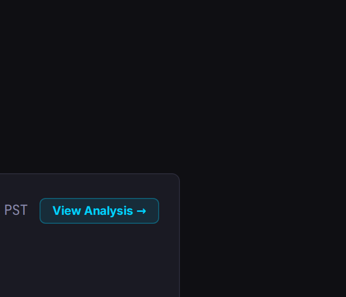
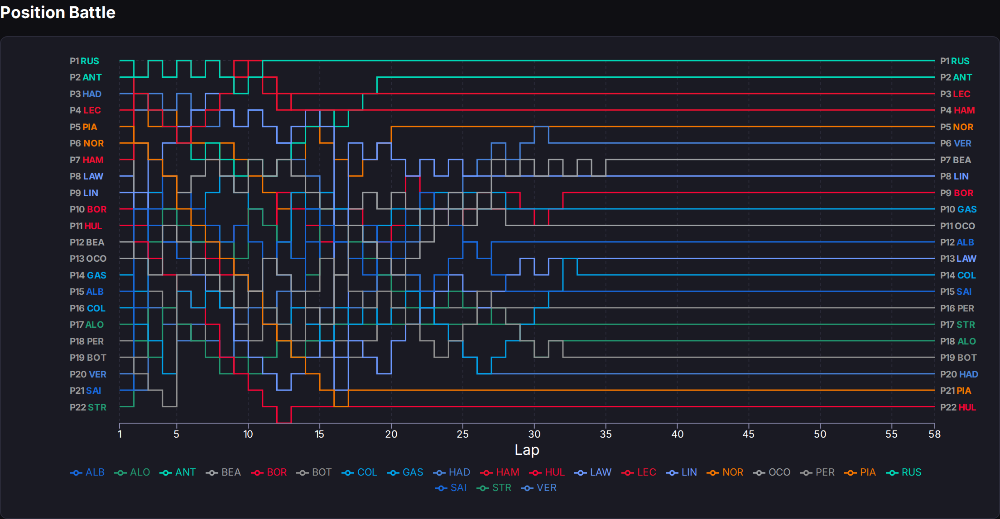
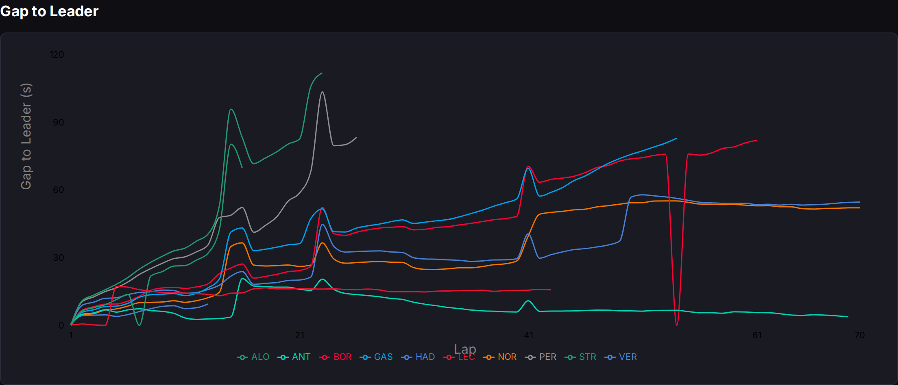
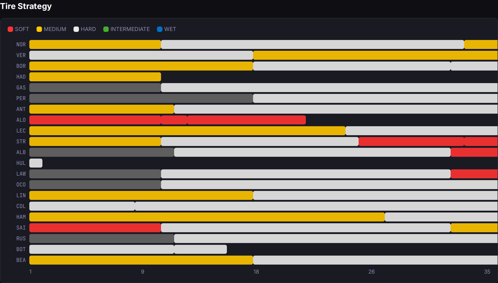
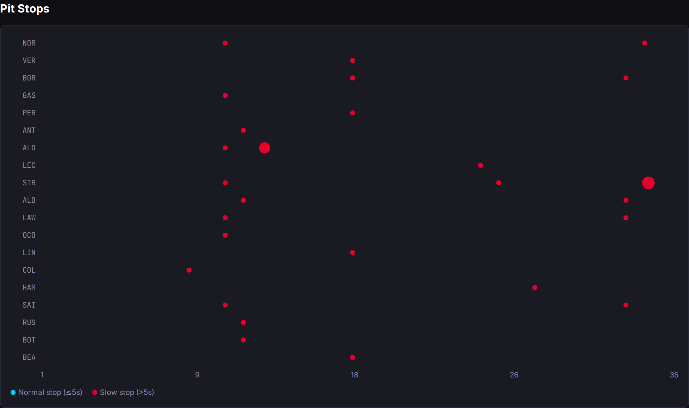

# Day 20: The Session Deep Dive — Telling the Story of a Race in Four Charts

*Posted May 3, 2026 · Karl Kuhnhausen*

---

Feature 006. The recap strip tells you *what* happened. The deep dive shows you *how* it happened.

Clicking "View Analysis" on any completed race or sprint session opens a dedicated analysis page with four charts, each designed to answer a different question about the session. No new external API calls at page-load time — all data is pre-fetched from OpenF1 during backfill and cached in Cosmos DB.

Here's the entry point — the cyan button appears below the session results table on any completed race:

---

## Chart 1: Position Battle

The most complex chart, and the one that tells the fullest story.

**How to read it:**

- **Y-axis is position** — P1 at the top, P22+ at the bottom. *Lower on the chart = worse position.* This is the opposite of most line charts where "up" means "better." Here, the top of the chart is winning.
- **X-axis is lap number** — left to right, from lights out to the checkered flag.
- **Each colored line is one driver** — identified by their three-letter acronym (NOR, VER, HAM, etc.) in the legend. Lines are colored with the driver's real team color: McLaren papaya orange, Red Bull dark blue, Ferrari red, Mercedes teal.
- **Horizontal lines mean stability** — a flat line across many laps means a driver held position. Long flat sections at the top of the chart indicate dominance.
- **Vertical drops or jumps are position changes** — a line jumping up (toward P1) means the driver overtook someone. A line dropping down means they lost a position. When two lines cross, that's the exact lap where the overtake happened.
- **Clusters of crossing lines are chaos** — pit stop windows and safety car restarts create dense crossing zones. The first 5-10 laps and the pit-stop windows (typically around laps 9-12 and laps 28-32 in the Australian GP above) show the most movement.
- **Lines that end early are retirements** — if a driver's line stops before the final lap, they retired or were classified as DNF. You can see HUL's line stopping around lap 3 in the chart above.

**What to look for:** Find your driver's color and trace it left-to-right. Did they gain positions over the race? Did they survive the first-lap chaos? Did they gain or lose during the pit window? The shape of the line tells the whole narrative arc.

The custom tooltip sorts drivers by position at that lap (P1 first), so hovering over any lap shows the running order at that exact moment.

---

## Chart 2: Gap to Leader

This answers: "How close was the race, really?"

**How to read it:**

- **Y-axis is time gap in seconds** to whoever is leading the race at that moment. The leader is always at 0.
- **X-axis is lap number.**
- **Lines close to 0 are fighting for the win.** A tight pack of lines near zero means a close race at the front. Lines that diverge steadily from zero mean the leader is pulling away.
- **Sudden spikes upward are pit stops.** When a driver pits, their gap jumps by 20-30 seconds (the time spent in the pit lane), then gradually comes down as they run on fresh tires. You can see these spikes clearly in the chart.
- **Lines converging back down after a spike** mean the driver on fresh tires is lapping faster than those ahead — the "undercut" or "overcut" playing out in real time.
- **Safety car periods compress the field** — all gaps collapse toward zero, then expand again on the restart.

**What to look for:** Ignore the pit-stop spikes and focus on the trend. Is the gap growing steadily (dominant leader) or oscillating (competitive battle)? Drivers whose gap stabilizes at a constant value are in "no man's land" — not fast enough to challenge ahead, not slow enough to be caught from behind.

---

## Chart 3: Tire Strategy

The board room of race strategy — who ran what compound and when they switched.

**How to read it:**

- **Each row is one driver** (three-letter acronym on the left).
- **The horizontal bar spans the full race distance** — lap 1 on the left, final lap on the right.
- **Colors are tire compounds:** 🔴 Soft (fastest, wears quickly), 🟡 Medium (balanced), ⚪ Hard (slowest, lasts longest), 🟢 Intermediate (light rain), 🔵 Wet (heavy rain).
- **Each colored segment is one stint** — the block of laps between pit stops on one set of tires. A gap between segments indicates a pit stop.
- **Longer segments = longer stints.** A driver with two long segments ran a conservative one-stop strategy. A driver with three shorter segments went aggressive on a two-stop.

**What to look for:** Compare strategies side by side. Did the race-winning team go Soft→Hard while everyone else went Medium→Hard? Did anyone gamble on a risky compound choice? Short stints at the end (e.g., a narrow Soft block in the last few laps) usually mean a driver pitted late for fresh tires to chase a fastest lap bonus point.

In the Australian GP, you can see NOR (Norris) ran a Soft→Hard two-stop, while VER (Verstappen) went Hard→Medium. ALO (Alonso) stands out with a triple-stint on Softs — an aggressive and unusual choice.

---

## Chart 4: Pit Stops

When did each driver pit, and how long did it take?

**How to read it:**

- **Each row is one driver.**
- **Dots are positioned horizontally by lap number** — left = early pit, right = late pit.
- **Dot size indicates pit stop duration** — larger dots = slower stops. A normal F1 pit stop takes about 2-3 seconds for the tire change itself. Stops over 5 seconds indicate a problem: a stuck wheel nut, a fumbled jack, or a slow release.
- **Color indicates speed:** cyan dots are normal stops (≤5s), red dots are slow stops (>5s).

**What to look for:** Consistent small dots across all stops = strong pit crew. One big red dot surrounded by small ones = a crew that had one bad moment. Drivers with dots at the same lap number pitted together — this is the "pit window" where strategy converges.

In the chart above, STR (Stroll) has a notably large red dot on his final stop around lap 34 — a slow stop that cost him time. Most drivers pitted around laps 9-12 for their first stop, creating a clear cluster in that zone.

---

## The Data Pipeline

All four charts are powered by the same data flow:

1. **Backfill CLI** fetches five data types from OpenF1 per session: `/positions`, `/intervals`, `/stints`, `/pit`, and `/drivers` (for team colors).
2. Data is aggregated per-lap (positions and intervals are reported multiple times per lap — we keep the final reading for each driver on each lap).
3. Aggregated data is stored in Cosmos DB as typed analysis documents (one per data type per round/session).
4. The React frontend fetches all analysis data in a single API call and renders the four charts.

The backfill respects OpenF1 rate limits with configurable delays between requests. Team colors — the hex values that make McLaren orange and Ferrari red — are fetched from the `/drivers` endpoint and stored alongside driver metadata so every chart renders in proper team livery colors.

Tooltips on the Position Battle chart sort drivers by position (P1 first), and on the Gap to Leader chart by smallest gap first. Both show the driver's acronym in their team color for quick visual identification.

---

## What I Learned

**Inverted Y-axes need explanation.** The Position Battle chart is counterintuitive because position 1 is at the top but it means "best." In most charts, the top-left is the maximum value. Here, the minimum value (P1) is at the top. Every user who sees this chart for the first time needs a moment to orient themselves. A Y-axis label saying "Position" with P1 at top helps, but it's still a learning curve.

**Pit stop spikes are noise in the gap chart.** The raw Gap to Leader data includes the 20+ seconds a driver spends in the pit lane. This is technically accurate but visually misleading — it looks like a driver suddenly fell 30 seconds behind when they really just pitted. Filtering these out would make a cleaner chart but would lose information. I kept the raw data and let users learn to read through the spikes.

**Team colors transform readability.** The first version used recharts' default color palette — generic blues, greens, and purples. Switching to actual team colors (fetched from OpenF1's `/drivers` endpoint) immediately made every chart scannable. You can spot "the red line" (Ferrari) or "the orange line" (McLaren) without checking the legend.

---

[← Day 19: The Session Recap Strip — Summarizing a Weekend at a Glance](day-19-session-recap-strip.md) · [Day 21: Analysis UX Polish →](day-21-analysis-ux-polish.md)
