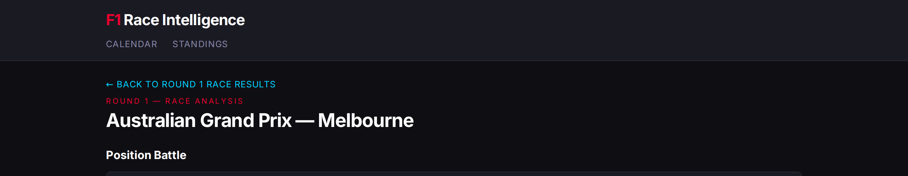
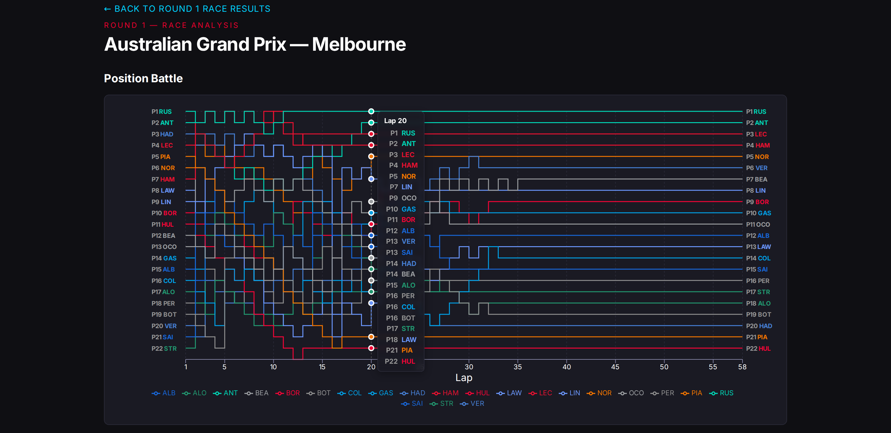
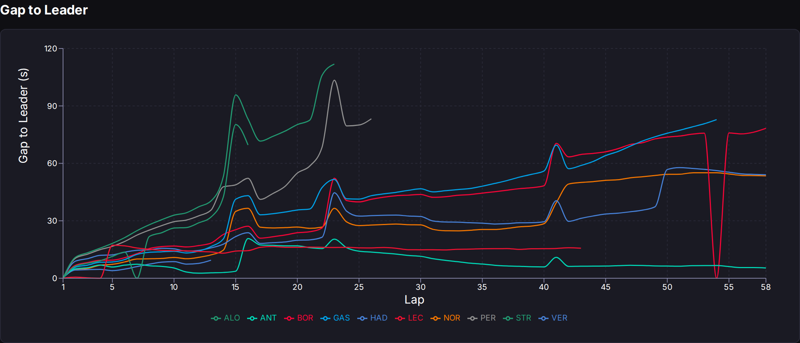
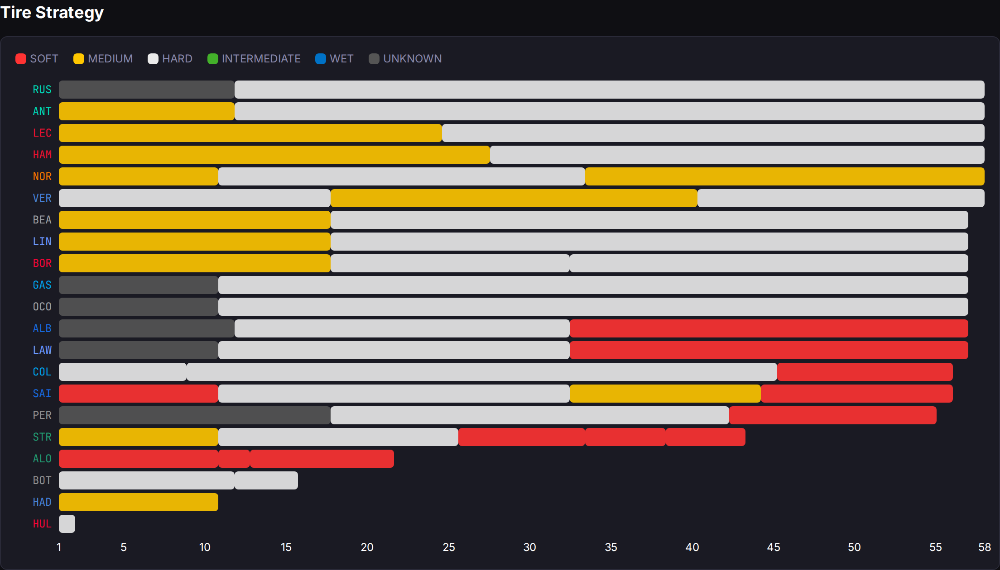
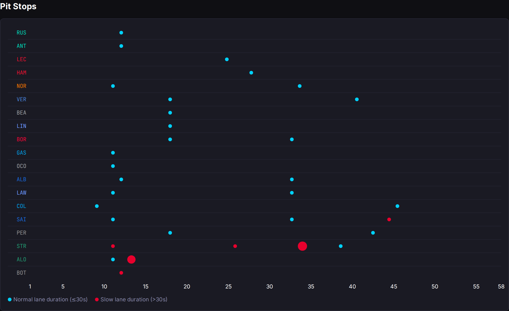

# Day 21: Analysis UX Polish — Making Four Charts Tell a Clearer Story

*Posted May 3, 2026 · Karl Kuhnhausen*

---

Day 20 shipped the analysis page. Day 21 makes it actually *good*.

The raw charts from Feature 006 worked, but they had a dozen paper cuts: unreadable axis labels against a dark background, grey bars where tire compounds should be, scrollbars on the strategy swimlanes, and a title that just said "Race Analysis — Round 1" with no indication of which Grand Prix you were looking at. Today was a UX polish pass that touched every chart, plus a backend change to automate analysis data ingestion.

## The Page Header

The analysis page now gets the same treatment as the round detail page: a red accent label ("ROUND 1 — RACE ANALYSIS"), the Grand Prix name and circuit in a large bold heading, and a cyan back link that says "← BACK TO ROUND 1 RACE RESULTS" instead of the generic "← Back to Round 1." The GP name and circuit are fetched from the rounds API in parallel with the analysis data, so the page loads just as fast.

## Position Battle — Reading the Race Story

The Position Battle chart is the heart of the analysis page. Each line traces a driver's position through the race, colored by team. The chart tells you everything about the competitive narrative at a glance:

- **Left labels (starting grid)**: Who qualified where. P1 RUS at the top means Russell started from pole.
- **Right labels (finishing order)**: Who finished where. Compare left to right to see who gained or lost positions.
- **Line crossings**: Every intersection is an overtake or position swap. Clusters of crossings indicate safety car restarts or pit stop windows.
- **Flat horizontal sections**: Stable running, no position changes. Long flat sections usually mean the drivers were in clean air.
- **Step changes**: The lines use step-after interpolation, so position changes appear as sharp vertical jumps rather than diagonal lines. This makes it clear exactly which lap a move happened on.

**The tooltip** shows all drivers' positions at the hovered lap, sorted P1 to P22 with grey position numbers and team-colored acronyms. A dashed cursor line marks the hovered lap.

**Y-axis ticks are gone.** The starting grid and finishing order labels on both sides make the Y-axis redundant. Removing the ticks reduces visual clutter and lets the lines breathe.

## Gap to Leader — Where the Race Was Won

The gap chart shows each driver's time deficit to the leader, lap by lap. It answers the question: "How close was the race, really?"

- **Lines converging toward zero**: A battle for the lead. When two lines nearly touch at zero, the trailing driver is right behind.
- **Lines diverging**: The leader pulling away. A widening gap means the leading car had superior pace.
- **Sharp spikes upward**: Pit stops. The driver drops 20-30 seconds while in the lane, then the line settles back to their true pace deficit. These aren't errors — they're real data showing exactly when each driver pitted.
- **Sudden convergence of the entire field**: Safety car or red flag. Everyone bunches up behind the safety car, compressing gaps to near-zero.

The gap chart shares the same 5-lap x-axis tick intervals and white axis labels as the position chart for visual consistency.

## Tire Strategy — Who Ran What, and When

The tire strategy chart shows each driver's stint sequence as horizontal bars. Drivers are sorted by finishing position (race winner at the top), and their three-letter abbreviation is colored by team.

**Compound colors**: Red for soft, gold for medium, grey for hard, green for intermediate, blue for wet. A dark grey "UNKNOWN" compound appears when OpenF1 doesn't report the tire for the opening stint — a known data gap we handle gracefully rather than crashing.

**How to read it**:
- Count the bars per driver to see how many pit stops they made.
- Compare bar lengths to understand stint duration — a very short stint usually means a problem (puncture, damage, or an undercut that didn't work).
- Look for strategic divergence: did the top three all use the same strategy, or did someone win on a different compound sequence?
- The x-axis spans the full race distance with the same 5-lap ticks, so you can cross-reference with the position chart to see how strategy affected the race.

## Pit Stops — Finding the Slow Stops

The pit stop timeline shows every pit stop as a dot on the race timeline, with dot size proportional to duration. The chart adapts based on available data:

- **When crew stop duration is available** (the time the car is stationary): dots represent stop duration, the slow threshold is 5 seconds, and the tooltip shows "X.Xs stop."
- **When only lane duration is available** (total time through the pit lane): dots represent lane duration, the slow threshold shifts to 30 seconds, and the tooltip shows "X.Xs lane."

Cyan dots indicate normal stops. Red dots indicate slow stops (above the threshold). A large red dot is immediately visible — that's where something went wrong: a stuck wheel nut, a driver overshot the box, or the crew fumbled a tire.

Drivers are sorted by finishing position, matching the tire strategy chart, so you can scan vertically to correlate pit timing with strategy and race positions.

## The Dark Theme Problem

Every axis label, tick mark, and tooltip in the original charts used `hsl(var(--foreground))` for text color. This is the standard Tailwind v4 approach — except Tailwind v4's CSS variables store raw hex values like `#ffffff`, not HSL channels. So `hsl(#ffffff)` renders as invisible or dark text.

The fix was straightforward: use direct hex values everywhere in Recharts inline styles. `#ffffff` for primary text, `#8888aa` for axis strokes, `#999999` for the position number labels, `rgba(26, 26, 35, 0.85)` for tooltip backgrounds with `backdropFilter: 'blur(4px)'` for the frosted glass effect.

## Automated Analysis Ingestion

Until today, populating analysis data required manually running the backfill CLI from inside the AKS cluster (Cosmos DB's firewall blocks external access). That's fine for initial population but unsustainable for an ongoing season.

The new **AnalysisScheduler** is an in-process goroutine that runs inside the API server:

1. **Polls every 15 minutes** for finalized Race/Sprint sessions.
2. **Waits 90 minutes** after each session's end time before attempting to fetch (giving OpenF1 time to publish).
3. **Checks `HasAnalysisData()`** first — if data already exists, it skips (idempotent).
4. **Retries up to 4 times** at 30-minute intervals if a fetch fails (data might not be available yet).
5. Runs alongside the existing calendar, standings, and session pollers with the same lifecycle.

This means new race analysis data will appear automatically within ~2 hours of each session ending, with no manual intervention. The scheduler is calendar-aware — it only triggers when sessions have actually completed, not on a blind cron schedule.

## What's Next

The analysis page is in a good place now. The remaining gaps are data availability: the Chinese GP sprint and Miami GP race haven't been backfilled yet (they need to run from inside the cluster). Once we deploy this build with the analysis scheduler, those will populate automatically on the next poll cycle.

Circuit maps would be a nice addition to the page header — showing the track layout alongside the GP name and circuit. That's a separate feature for another day.

---

[← Day 20: The Session Deep Dive — Telling the Story of a Race in Four Charts](day-20-session-deep-dive.md) | [Day 22: The Standings Overhaul — Real Data, Real Bugs, and a Credit Long Overdue →](day-22-standings-overhaul.md)
