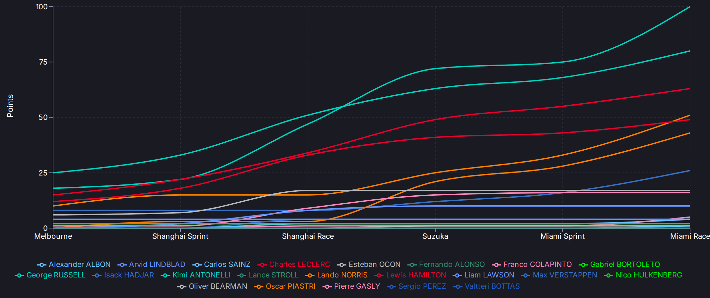

# Day 24: "USA Race" Is Not a Circuit — Fixing the Progression Chart Labels

*Posted May 5, 2026 · Karl Kuhnhausen*

---

The standings progression chart shipped with Feature 007 had a readability problem hiding in plain sight. The X-axis labels read "Australia", "China Sprint", "China Race", "Japan", "USA Sprint", "USA Race." Country names. Technically correct — Miami is in the United States — but nobody watching F1 calls the Miami Grand Prix "USA Race." They call it Miami.

The data was already there. OpenF1's `/v1/meetings` endpoint returns a `circuit_short_name` field with exactly the values you'd want: "Melbourne", "Shanghai", "Suzuka", "Miami." The ingest layer was already storing it in the `CircuitName` field of every meeting document in Cosmos. The `buildRoundLabels` function in the standings service just... preferred `CountryName` over it.

## The One-Line Fix

The original code:

```go
name := m.CountryName
if name == "" {
    name = m.CircuitName
}
name = shortenCircuitLabel(name)
```

The `shortenCircuitLabel` helper existed solely to patch country names into less-awkward forms — "United States" → "USA", "United Arab Emirates" → "Abu Dhabi." A function whose entire purpose was to work around using the wrong field.

The fix:

```go
name := m.CircuitName
if name == "" {
    name = m.CountryName
}
```

No shortening needed. Circuit short names are already short. `shortenCircuitLabel` became dead code and was deleted.

**Before:** Australia, China Sprint, China Race, Japan, USA Sprint, USA Race

**After:** Melbourne, Shanghai Sprint, Shanghai Race, Suzuka, Miami Sprint, Miami Race

## The Result



The chart now reads the way an F1 fan would talk about the season: Melbourne, Shanghai, Suzuka, Miami. When the calendar reaches circuits in countries that host multiple races (like the United States with Miami, Las Vegas, and Austin), the labels will naturally disambiguate — "Miami Race" vs "Las Vegas Race" — instead of showing three indistinguishable "USA Race" entries.

Sprint weekends still get the suffix: "Miami Sprint" and "Miami Race" for the two scoring sessions at a sprint weekend. Standard weekends show just the circuit name.

## What Changed

One file, two edits: swap `CountryName` for `CircuitName` in the label builder, delete the unused `shortenCircuitLabel` function. PR [#80](https://github.com/karlkuhnhausen/f1-race-intelligence/pull/80).

The kind of fix where the hardest part is noticing the problem.

---

[← Day 23: The Round Numbers Were Lying — A Cancelled-Race Desync](day-23-cancelled-round-desync.md) | [Day 25: The Sprint Sessions That Showed Nothing →](day-25-sprint-session-saga.md)
