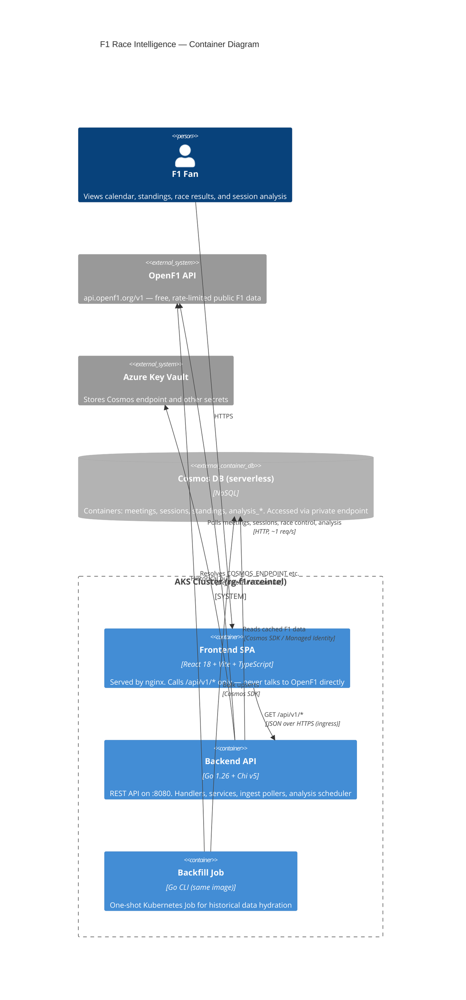
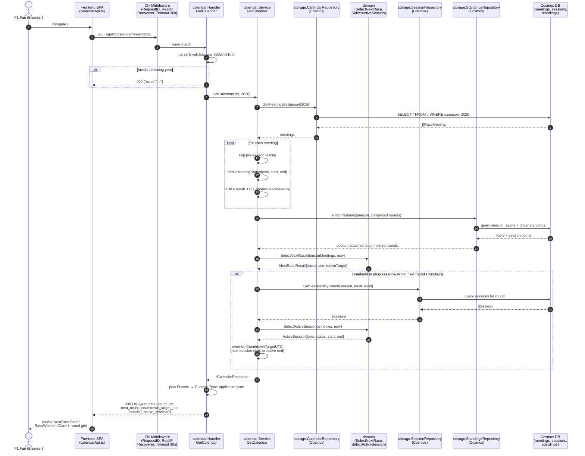

# Day 27: Visualizing the Codebase — C4 and a Sequence Diagram for One Endpoint

*Posted May 10, 2026 · Karl Kuhnhausen*

---

Twenty-seven days of build-in-public commits, twenty-six blog posts, and at some point you stop being able to keep the whole system in your head. I can describe the calendar endpoint in prose. I can point at the file that serves it. But when someone asks me *"what actually happens when the browser hits `/api/v1/calendar`?"* I find myself opening four files and waving my hands.

So today I did the thing I should have done weeks ago: I generated diagrams.

Two of them. A C4 container diagram for the whole system, and a sequence diagram for a single request — `GET /api/v1/calendar?year=2026`. Both are Mermaid, both live in this repo, and both will get regenerated whenever the architecture moves.

---

## Why Mermaid

I looked at the usual suspects — Sourcetrail, go-callvis, madge, dependency-cruiser, gocity, gource. Each of them tells you something useful. go-callvis renders the Go call graph as an SVG. madge does the same for the React module tree. gource turns the git log into a satisfying little particle system.

But all of them produce static artifacts you have to regenerate, store, and link to. For *explaining* what the system does in a blog post, Mermaid wins on two axes:

1. **It renders inline on GitHub.** No image hosting, no broken links, no checking a 400 KB SVG into the repo.
2. **It's editable in markdown.** When I add a new service tomorrow, I edit five lines in a code fence, not a graphviz toolchain.

The trade-off is precision. Mermaid won't enumerate every function call or every package edge. But for the *architectural narrative* — what talks to what, in what order — it's the right zoom level.

---

## C4: the whole system on one page

The C4 model has four levels: Context, Container, Component, Code. For a side project running one backend, one frontend, and a database, **Container is the right level**. Anything higher loses detail; anything lower turns into a haystack.

Here's what the system actually looks like today:

A few things this diagram makes obvious that prose has been hiding:

- **Tier boundaries hold.** The frontend has exactly one arrow leaving it, and it lands on the backend. The fan never sees OpenF1. That's Constitutional Principle II working as designed.
- **OpenF1 is a backend concern.** Every OpenF1 arrow originates from a container *inside* the cluster. The browser is not in that conversation. That's Principle III — OpenF1 data residency — drawn in lines.
- **The backfill job is the same image as the API.** Same Dockerfile, different `ENTRYPOINT`. It only exists as a separate node because it has a different lifecycle (one-shot Kubernetes Job vs. always-on Deployment).
- **Key Vault is on a different code path than Cosmos.** I sometimes forget this. KV is touched once at startup to resolve the Cosmos endpoint; Cosmos is touched on every request. They look symmetric in the diagram, but the access patterns aren't.

---

## Sequence: what happens when you hit `/api/v1/calendar`

The container diagram tells you what exists. The sequence diagram tells you what runs. This one walks through a single calendar request, end to end:

This one surprised me even though I wrote the code. Three observations:

**Status is derived at read time, not stored.** The `deriveMeetingStatus` call in the loop is doing real work on every request. The `Status` field in Cosmos is effectively a cache — the wall clock plus the start/end dates are the source of truth. That's why a race flips to `completed` exactly when you'd expect, with no ingest cycle in the loop.

**There's no OpenF1 in this path.** Zero. The calendar endpoint is pure Cosmos. OpenF1 polling happens out-of-band in `OpenF1Poller` and `AnalysisScheduler`, on a separate goroutine, on a separate cadence. The request hot path never blocks on an external service. That's Principle III pulling its weight.

**Weekend enrichment is a conditional branch, not a separate endpoint.** I'd half-remembered that "race weekend mode" was a separate code path. It isn't. It's an `alt` inside `GetCalendar` that fires when `now` is inside the next round's window. Same handler, same response shape, one extra field (`active_session`). That's why the frontend can switch between `NextRaceCard` and `RaceWeekendCard` from a single API call.

---

## How I'd extend this

If I do this again for another endpoint, I'd add one more diagram type: a **state diagram for meeting lifecycle** (`scheduled` → `in_progress` → `completed`, with `cancelled` as an absorbing state). The status logic is scattered across `domain.DeriveSessionStatus`, `deriveMeetingStatus`, and the cancellation overrides — a state diagram would put it all on one page.

I'd also stop at three diagrams per post. Four is where the eye starts skimming.

---

## Toolchain notes

For anyone replicating this:

- **Mermaid** renders natively on GitHub. No install. Just put it in a `\`\`\`mermaid` code fence.
- **Repomix** (`npx repomix --include "backend/**,frontend/src/**,deploy/helm/**" -o tmp/repo-flat.xml`) flattens the relevant subset of the repo into a single XML file. 122 files, ~112k tokens — small enough for one LLM context window.
- I gitignored `/tmp/` in the repo root so the flattened output never leaves my machine.
- For more precise visualizations (call graphs, module dependency graphs), `go install github.com/ofabry/go-callvis@latest` and `npx madge --image graph.svg --extensions ts,tsx frontend/src/` are the two tools I'd reach for next.

Total time to generate both diagrams: about twenty minutes. Total time to *write the post around them*: ninety. The hand-waving is the hard part, not the picture.

---

[← Day 26: 657 Unhealthy — Triaging Defender for Cloud on a Side Project](day-26-defender-recommendations.md)
